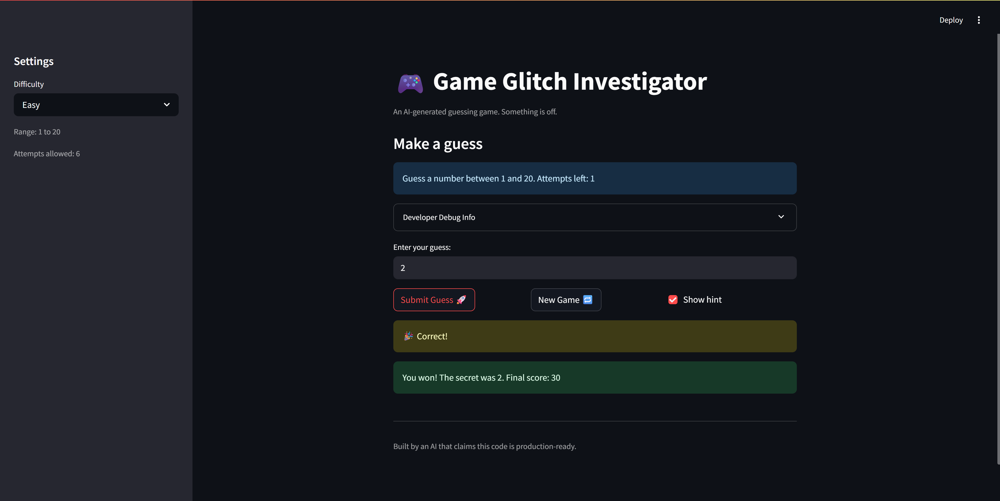

# 🎮 Game Glitch Investigator: The Impossible Guesser

## 🚨 The Situation

You asked an AI to build a simple "Number Guessing Game" using Streamlit.
It wrote the code, ran away, and now the game is unplayable. 

- You can't win.
- The hints lie to you.
- The secret number seems to have commitment issues.

## 🛠️ Setup

1. Install dependencies: `pip install -r requirements.txt`
2. Run the broken app: `python -m streamlit run app.py`

## 🕵️‍♂️ Your Mission

1. **Play the game.** Open the "Developer Debug Info" tab in the app to see the secret number. Try to win.
2. **Find the State Bug.** Why does the secret number change every time you click "Submit"? Ask ChatGPT: *"How do I keep a variable from resetting in Streamlit when I click a button?"*
3. **Fix the Logic.** The hints ("Higher/Lower") are wrong. Fix them.
4. **Refactor & Test.** - Move the logic into `logic_utils.py`.
   - Run `pytest` in your terminal.
   - Keep fixing until all tests pass!

## 📝 Document Your Experience

- [ ] Describe the game's purpose.
This game is for the users to guess a random secret number within a specific range. They can choose one of the 3 modes and can restart the game. Easy mode has a number range between 1 and 20 and 6 attempts total, Normal mode has a number range between 1 and 100 and 8 attempts total, and Hard mode has a number range between 1 and 50 and 5 attempts total.
- [ ] Detail which bugs you found.
I found that the hints are going backwards, and the number range and the number of attempts are set up incorrectly based on the selected mode. For example, if I guess 50, the hint says "Go HIGHER", but the secret number is actually lower than 50, so it is giving reversed hints. Also, if I choose Easy mode, the number range and the number of attempts stay the same as the Normal mode.
- [ ] Explain what fixes you applied.
I fixed the check_guess function to swap the messages "Go LOWER" and "Go HIGHER" to the appropriate conditions, and I added reset_game() function and get_attempts_for_difficulty() function to set the number range and the number of attempts based on the selected mode. I moved the main game logic functions to the logic_utils.py, and generated test cases using the Copilot Agent Mode.

## 📸 Demo

- [ ] [Insert a screenshot of your fixed, winning game here]

## 🚀 Stretch Features

- [ ] [If you choose to complete Challenge 4, insert a screenshot of your Enhanced Game UI here]
